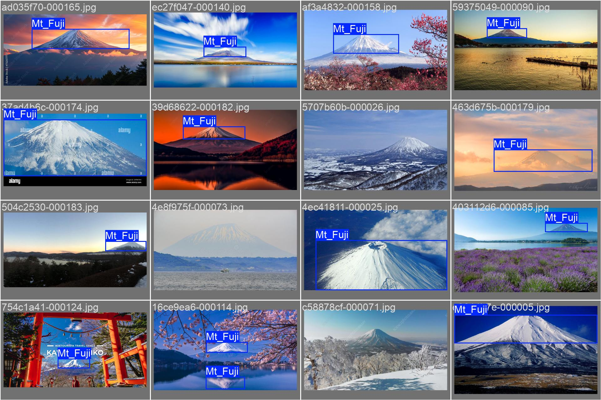
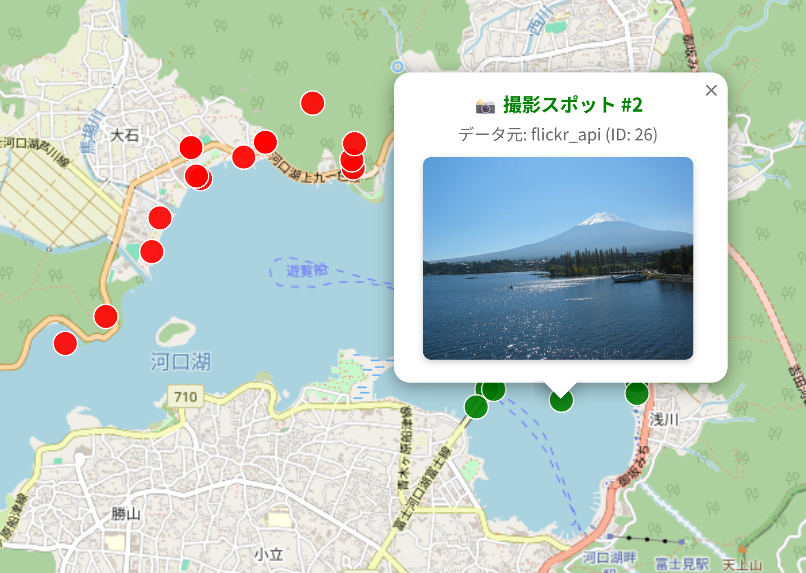
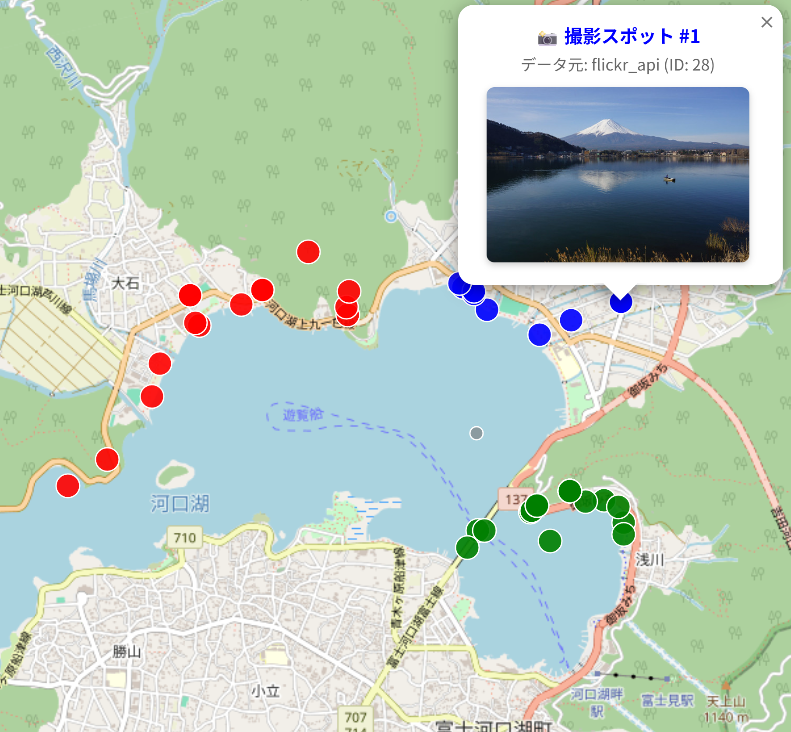
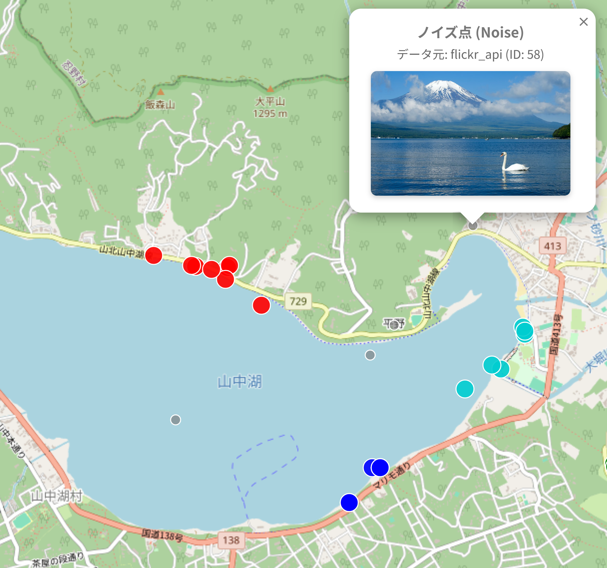

システム名：**FujiSpot Finder**  
link:https://docs.google.com/presentation/d/1p0Fa2v5N2ae8VbCPMhR68ZYiTEpHUO9K6BOaxCsEsNk/edit?slide=id.p#slide=id.p  
評価指標：正しく写真内で富士山があるかどうかを判断できる  

**現状の課題**：富士山、特に河口湖周辺は世界的撮影聖地だが、最適な撮影ポイントの特定は個人の経験や断片的なネット情報に依存している。  
**方向性と目的**：「どこで撮るべきか」を直感ではなく、データとAI（YOLO × DBSCAN）で客観的に導き出す。撮影者の移動コストを最小化し、誰もが「最高の一枚」に出会える撮影スポット自動特定システムの構築。  
**システムの仕組み**  
YOLOv8を用いてFlickrに投稿された富士山写真を判定し、富士山と判定された写真については地図上に撮影地を表示し、それ以外は表示しない。その後、全ての撮影地に対してDBSCANアルゴリズムによるクラスタリング分析を実施し、富士山を撮影する名所（FujiSpot）を特定する。  

1. ネットから画像データを集めて、ラベリングする
2. YOLOv8を用いてトレーニングを行う
3. モデルはFlickrの投稿写真に富士山があるかどうかを判断
4. Yesと判断された写真は、経緯度情報によって地図上に表示
5. DBSCANを通じてクラスタリングする

**YOLO動作例**：  

**実装例**：  

